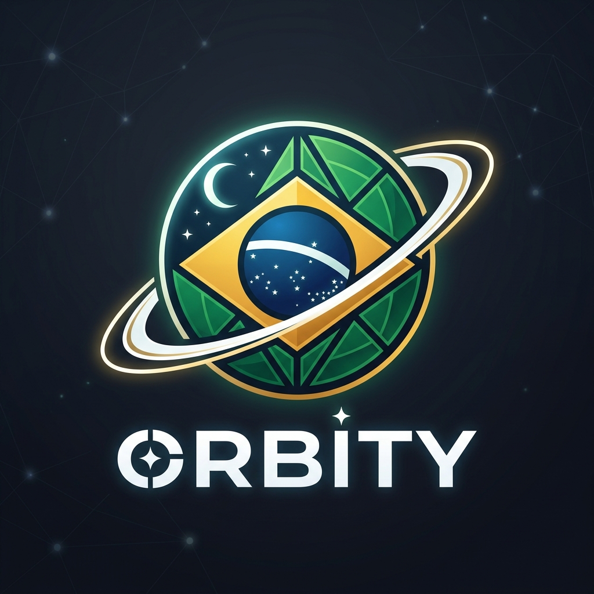

<div align="center">
  
  <h1>🪐 ORBITY</h1>
  <p><strong>High-Performance Autonomous Multi-Agent Orchestrator in Rust (v0.1.0-beta)</strong></p>

  [](Cargo.toml)
  [](Cargo.toml)
  [](https://github.com/geanderson/meza-agentic-orchestrator)
  [](https://www.rust-lang.org)
  [](https://sqlite.org)
  [](https://github.com/containers/bubblewrap)
  [](https://tokio.rs)
  [-brightgreen?style=for-the-badge)](docs/IMPLEMENTATION_PLAN.md)
  [](docs/index.html)
</div>

<br/>

---

## Table of Contents

- [Overview](#overview)
- [Problem Statement](#problem-statement)
- [Objectives](#objectives)
- [Use Cases](#use-cases)
- [Key Features](#key-features)
- [Architecture](#architecture)
- [Tech Stack](#tech-stack)
- [Repository Structure](#repository-structure)
- [Installation](#installation)
- [Configuration](#configuration)
- [Quick Start](#quick-start)
- [Usage Examples](#usage-examples)
- [API / CLI Reference](#api--cli-reference)
- [Web Application](#web-application)
- [Integrations](#integrations)
- [Security](#security)
- [Observability & Logging](#observability--logging)
- [Testing](#testing)
- [Performance](#performance)
- [Roadmap](#roadmap)
- [Known Limitations](#known-limitations)
- [FAQ](#faq)
- [Contributing](#contributing)
- [Local Development](#local-development)
- [Coding Standards](#coding-standards)
- [Issues](#issues)
- [Pull Requests](#pull-requests)
- [Releases / Changelog](#releases--changelog)
- [Versioning](#versioning)
- [License](#license)
- [Project Governance](#project-governance)
- [Code of Conduct](#code-of-conduct)
- [Community / Support](#community--support)
- [Authors / Maintainers](#authors--maintainers)
- [Acknowledgments](#acknowledgments)

---

## Overview

**Orbity** is an enterprise-grade, high-performance runtime and orchestrator for autonomous artificial intelligence agents, engineered from the ground up in **Rust**.

Orbity replaces brittle, script-based agent execution with **deterministic directed acyclic graph (DAG) computing**, **kernel-enforced process confinement via Bubblewrap (`bwrap`)**, **mathematically verifiable append-only auditing in SQLite WAL (hash-chained with SHA-256)**, **real-time FinOps budget tripwires**, and a **reactive full-stack server application powered by Tokio Topcoat (v0.9+)**.

Built with a zero-trust mindset, Orbity coordinates specialized teams of 5 native command-line coding assistants (`agy`, `codex`, `claude`, `hermes`, and `pi`) with complete isolation, high concurrency (>75,400 events/second), and declarative YAML governance.

---

## Problem Statement

Current AI agent frameworks (predominantly written in Python) face severe engineering shortcomings when deployed to production:

1. **Host Security Vulnerabilities:** Agents generate arbitrary bash commands that execute directly on developer or production hosts, creating severe risks of data loss (`rm -rf /`), secret exfiltration (`~/.ssh/id_rsa`, `.env`), or arbitrary network access.
2. **Agent Drift & Hallucination Loops:** Relying on unconstrained LLM supervisors leads to recurring infinite loops, broken state transitions, and inability to recover cleanly from failures.
3. **Black-Box Financial Costs:** API costs compound silently without real-time enforcement, resulting in runaway billing spikes before human operators notice.
4. **Human Approval Fatigue:** Developers are constantly interrupted to approve trivial read-only commands, negating the productivity gains of autonomous tooling.
5. **Untraceable Logs:** Plaintext log files can be modified, truncated, or forged, offering zero mathematical guarantee for compliance, security audits, or forensic investigation.

---

## Objectives

Orbity was built to establish an industrial standard for autonomous multi-agent execution:

- **Enforce Kernel-Level Confinement:** Guarantee that all agent commands execute in a disposable, read-only root sandbox with zero host pollution and instant (2ms) rollback.
- **Provide Mathematical Auditability:** Seal every lifecycle event, file mutation, and tool invocation in an append-only SQLite hash chain verified by SHA-256.
- **Ensure Deterministic Orchestration:** Execute agent pipelines using Kahn's topological sort on DAGs, concurrent Tokio fan-out, barrier fan-in joins, and controlled feedback loops with circuit breakers.
- **Deliver Real-Time FinOps:** Track input, output, cache read, and reasoning tokens call-by-call with hard stop tripwires before budgets are exceeded.
- **Enable Autonomous Governance:** Allow teams to define declarative auto-approval (`auto_approve`) and rejection (`auto_reject`) policies in YAML, eliminating manual confirmation fatigue.
- **Maintain Low Overhead & High Throughput:** Keep memory consumption under 25MB of RAM while handling over 75,000 events per second with zero garbage collection pauses.

---

## Use Cases

- **Autonomous Code Refactoring & Migration:** Run multi-agent squads that parse codebases, execute refactoring recipes, compile in isolated sandboxes, and run test suites with automatic rollbacks on test failure.
- **Automated Security & Vulnerability Auditing:** Coordinate static analysis with `claude`, penetration testing with `hermes`, and deep dependency tree inspection with `agy` in offline network sandboxes.
- **Continuous Integration & Auto-Healing:** Deploy Orbity workers in CI/CD pipelines to autonomously diagnose build errors, write patches with `codex`, and verify zero test regressions.
- **Compliance & Regulated Environments:** Operate in financial, healthcare, or government environments where every automated action must be cryptographically auditable for SOC2/ISO27001 certification.
- **Budget-Capped Research & Development:** Let autonomous agents perform iterative codebase experiments under strict financial caps (e.g., stopping automatically at $2.00 USD).

---

## Key Features

- 🛡️ **Zero-Escape Bubblewrap Sandbox:** Linux namespace isolation with host root mounted as strictly read-only (`--ro-bind / /`), ephemeral workspace in memory (`tmpfs`), isolated network stack (`--unshare-net`), and deterministic 2ms rollback.
- 🔗 **Blockchain-Lite Cryptographic Audit Store:** Append-only ledger in SQLite WAL where every block incorporates the SHA-256 hash of its predecessor, from Genesis block `#0` to final completion. Detects tampering with 100% precision.
- 🕸️ **Graph Engineering & DAG Execution:** Topological graph motor with Kahn's algorithm, concurrent Tokio `fan-out`, barrier `fan-in` joins, and circuit-breaker feedback loops.
- 👥 **Native 5-CLI Worker Suite:** Direct adapter interfaces for the industry's premier coding CLIs:
  - `agy` (Antigravity CLI): Deep codebase exploration, planning, and MCP tool inspection.
  - `codex` (Codex CLI): Code generation, Rust implementation, and sandbox test execution.
  - `claude` (Claude Code): Critical invariant review, diff auditing, and security inspection.
  - `hermes` (Nous Hermes Agent): External tool calling and structured execution.
  - `pi` (Pi AI Coding Assistant): Surgical, low-overhead single-file diffs and lint fixes.
- 💰 **FinOps Engine with Hard Tripwires:** Call-by-call token accounting (input, output, cache, reasoning) converted to USD against a declarative budget cap. Halts execution before overage occurs.
- ⚙️ **Declarative YAML Configuration & Hot Sync:** Sub-millisecond folder scanner and SHA-256 hash reconciler for `teams/` and `agents/` directories with SQLite persistence.
- ⚡ **Tokio Topcoat Reactive Web Console (v0.9+):** Full-stack web server application in Rust featuring `Cx` context, reactive `view!`, client `signal` primitives, DOM-morphing `#[shard]` components, streaming SSR (`live!` / `emit!`), and WebSockets server-push.

---

## Architecture

The diagram below outlines the core layers of the Orbity system:

```
┌─────────────────────────────────────────────────────────────────────────────┐
│                          ORBITY RUNTIME ARCHITECTURE                        │
├──────────────────────┬───────────────────────────────┬──────────────────────┤
│    GOVERNANCE LAYER  │        TOPOLOGY ENGINE        │      SECURITY & OS   │
├──────────────────────┼───────────────────────────────┼──────────────────────┤
│ • YAML Team Specs    │ • Directed Acyclic Graph (DAG)│ • Bubblewrap Sandbox │
│ • approval_policy    │ • Kahn Topological Sorting    │ • Root Filesystem RO │
│ • auto_approve Rules │ • Concurrent Tokio Fan-out    │ • Ephemeral tmpfs    │
│ • Hard Budget Caps   │ • Fan-in Join Barrier         │ • Offline Network    │
│ • State Checkpoints  │ • Blackboard Shared Memory    │ • SIGKILL Timeouts   │
├──────────────────────┴───────────────────────────────┴──────────────────────┤
│               FOUR-LAYER EVENT BUS & TELEMETRY PIPELINE                     │
│  Layer 1: Runtime  •  Layer 2: Execution  •  Layer 3: Audit  •  Telemetry   │
├─────────────────────────────────────────────────────────────────────────────┤
│                  FULL-STACK REACTIVE TOKIO TOPCOAT SERVER                   │
│      Context Cx  •  view!  •  signal  •  #[shard]  •  live! / emit!         │
└─────────────────────────────────────────────────────────────────────────────┘
```

### The 4-Layer Observability Model
1. **Runtime Logs (Layer 1):** Agent lifecycle transitions (`AgentStarted`, `AgentPaused`, `AgentFinished`, `ApprovalGranted`).
2. **Execution Logs (Layer 2):** Command invocations, tool arguments, duration, and file hashes before and after execution.
3. **Audit Logs (Layer 3):** Append-only cryptographic ledger in SQLite WAL with SHA-256 chaining.
4. **Telemetry Logs (Layer 4):** Hierarchical OpenTelemetry spans (`run -> graph_step -> worker_node`) and token metrics exportable to Prometheus, Grafana, and Loki.

---

## Tech Stack

| Domain | Technology / Library | Purpose |
|---|---|---|
| **Core Language** | **Rust (2024 Edition)** | High performance, memory safety, zero-cost abstractions |
| **Async Runtime** | **Tokio** | Multi-threaded async I/O, timer primitives, worker task spawning |
| **Server Framework** | **Tokio Topcoat (v0.9+)** | Full-stack reactive web server, DOM-morphing shards, streaming SSR |
| **Storage Engine** | **SQLite 3 (via SQLx)** | WAL mode, synchronous=NORMAL, append-only cryptographic ledger |
| **Sandbox Confinement** | **Bubblewrap (`bwrap`)** | Linux namespaces (PID, IPC, UTS, Mount, Net), tmpfs, ro-bind |
| **CLI Framework** | **Clap (v4 Derive)** | Typed command parsing, subcommands, interactive `--help` |
| **Hashing & Crypto** | **`sha2` (SHA-256)** | State checkpointing and blockchain-lite audit hash chaining |
| **Observability** | **`tracing`, OpenTelemetry** | Structured logging, 4-layer sinks, OTLP JSON telemetry export |

---

## Repository Structure

The workspace is organized into clean, modular crates adhering to single-responsibility principles:

```
.
├── Cargo.toml                       # Cargo Workspace configuration (8 crates)
├── Cargo.lock                       # Deterministic dependency lockfile
├── README.md                        # User and developer documentation (this file)
├── assets/                          # Logos, icons, and visual media
├── docs/                            # Deep technical documentation and specs
│   ├── overview.md                  # Comprehensive architectural handbook
│   ├── CONTRACTS_AND_LIFECYCLE.md   # YAML schemas, enums, and auto-approval policies
│   ├── JOURNEY_MAP_AND_AUDIT.md     # 4-phase multi-agent lifecycle specification
│   ├── IMPLEMENTATION_PLAN.md       # Quality Gates 0-7 tracking & commit evidence
│   ├── VIDEO_STORYTELLING_REMOTION.md # Script and React code for programmatic video
│   └── index.html                   # Interactive GitHub Pages portal
├── examples/                        # Declarative YAML definitions
│   ├── forester/                    # Complete team and agent example
│   │   ├── teams/                   # forester.yaml
│   │   └── agents/                  # agente01.yaml, agente02.yaml
│   └── minimal/                     # Smallest valid team and agent setup
│       ├── teams/                   # minimal.yaml
│       └── agents/                  # minimal.yaml
└── crates/                          # Rust modular crates
    ├── orbity-core/                 # Fundamental types, RuntimeEvent, TokenUsage, SecretMasker
    ├── orbity-storage/              # SQLite WAL pool, DAOs, AuditStore with SHA-256 chain
    ├── orbity-sandbox/              # Bubblewrap process confinement, tmpfs, rollback engine
    ├── orbity-graph/                # Graph computing, Kahn sorting, Fan-out/in, Blackboard
    ├── orbity-agent/                # 5 CLI worker adapters, FinOps engine, MultiAgentOrchestrator
    ├── orbity-telemetry/            # 4-layer logging pipeline, OpenTelemetry spans & metrics
    ├── orbity-server/               # Tokio Topcoat full-stack reactive server & WebSockets
    └── orbity-cli/                  # Executable binary, clap commands, preflight doctor & sync
```

### Technical Documentation Index (`docs/`)
- [📖 **Architectural & Engineering Handbook (`docs/overview.md`)](docs/overview.md)** — In-depth architectural guide, kernel-level security guarantees, and production deployment.
- [📜 **Contracts, Lifecycle & Declarative YAML (`docs/CONTRACTS_AND_LIFECYCLE.md`)](docs/CONTRACTS_AND_LIFECYCLE.md)** — Schema definitions, auto-approval/auto-rejection policies, and Rust domain models.
- [🗺️ **Multi-Agent Journey Map & Audit Sweep (`docs/JOURNEY_MAP_AND_AUDIT.md`)](docs/JOURNEY_MAP_AND_AUDIT.md)** — 4-phase lifecycle breakdown (Creation, Execution, Analysis, Finalization).
- [📋 **Quality Gates Implementation Plan (`docs/IMPLEMENTATION_PLAN.md`)](docs/IMPLEMENTATION_PLAN.md)** — Full blueprint of all 8 Quality Gates (0-7), DoD criteria, and commit tracking.
- [🎬 **Storytelling & Remotion Video Script (`docs/VIDEO_STORYTELLING_REMOTION.md`)](docs/VIDEO_STORYTELLING_REMOTION.md)** — Complete scene-by-scene script and React/Remotion code.
- [🌐 **Interactive Web Portal (`docs/index.html`)](docs/index.html)** — Interactive graph simulator, terminal mock, and audit console.
- [📁 **Complete Example (`examples/forester/`)](examples/forester/) — Production-ready declarative team and agent specifications.
- [📁 **Minimal Example (`examples/minimal/`)](examples/minimal/) — Smallest valid YAML setup for a team and an agent.

---

## Installation

### Automated Setup Script (Recommended)
Orbity provides an automated, cross-platform bootstrap script (`setup.sh`) that delivers rich, colorized, and declarative progress logs throughout the entire setup process.

It automatically:
1. **Detects OS & Distro:** Linux (Ubuntu, Debian, Fedora, Arch, Alpine, openSUSE), macOS (via Homebrew), and Windows (WSL2).
2. **Installs System Dependencies:** Installs `bubblewrap` (bwrap), `sqlite3`, `pkg-config`, `curl`, `git`, and C compilers if missing.
3. **Verifies Rust Toolchain:** Checks for `cargo` and `rustc` ($\ge 1.80$); automatically bootstraps `rustup` if needed.
4. **Audits the 5 AI Coding CLIs:** Scans `$PATH` and user tool directories (`~/.local/bin`, `~/.hermes/node/bin`, `~/.cargo/bin`) for `claude`, `codex`, `pi`, `hermes`, and `agy`, printing a real-time status matrix with versions and paths.
5. **Configures Global Terminal Access:** Permanently exports binary paths to your shell profile (`~/.bashrc`, `~/.zshrc`, `~/.profile`).
6. **Compiles & Deploys Globally:** Compiles Orbity with LTO optimizations and installs the `orbity` binary to `~/.local/bin/orbity`.
7. **Runs Health Preflight:** Executes `orbity doctor` automatically to verify end-to-end operational readiness.

```bash
# Clone the repository
git clone https://github.com/geanderson/meza-agentic-orchestrator.git
cd meza-agentic-orchestrator

# Interactive mode (asks for confirmation before applying system changes):
./setup.sh

# Unattended / non-interactive mode (ideal for CI/CD, Docker, or quick setup):
./setup.sh -y

# Check-only mode (audits environment & CLIs without installing or compiling):
./setup.sh --check-only

# Non-intrusive mode (does not modify shell profiles like .bashrc or .zshrc):
./setup.sh --no-shell-edit
```

#### Declarative Visual Output Preview:
```text
  ██████╗ ██████╗ ██████╗ ██╗████████╗██╗   ██╗
 ██╔═══██╗██╔══██╗██╔══██╗██║╚══██╔══╝╚██╗ ██╔╝
 ██║   ██║██████╔╝██████╔╝██║   ██║    ╚████╔╝ 
 ██║   ██║██╔══██╗██╔══██╗██║   ██║     ╚██╔╝  
 ╚██████╔╝██║  ██║██████╔╝██║   ██║      ██║   
  ╚═════╝ ╚═╝  ╚═╝╚═════╝ ╚═╝   ╚═╝      ╚═╝   
  High-Performance Autonomous Multi-Agent Orchestrator

==> 1. Detecting Operating System & Architecture
[INFO] Operating System: Linux (Ubuntu 24.04 LTS)
[INFO] Architecture: x86_64
[✓] OS platform is supported.

==> 2. Verifying System Dependencies (bubblewrap, sqlite3, curl, git, build tools)
[✓] Package 'bubblewrap' (bwrap) is installed (/usr/bin/bwrap).
[✓] Package 'sqlite3' is installed (/usr/bin/sqlite3).
[✓] Package 'curl' is installed (/usr/bin/curl).
[✓] Package 'git' is installed (/usr/bin/git).
[✓] C compiler 'gcc' is installed (/usr/bin/gcc).
[✓] Tool 'pkg-config' is installed (/usr/bin/pkg-config).
[✓] All required system packages are present.

==> 3. Verifying Rust Toolchain (rustc, cargo)
[✓] Rust compiler found: rustc 1.85.0
[✓] Cargo package manager found: cargo 1.85.0

==> 4. Auditing Suite of 5 AI Coding CLIs (claude, codex, pi, hermes, agy)

  CLI        STATUS       BINARY PATH                                   VERSION
  ────────────────────────────────────────────────────────────────────────────────────────
  claude     [FOUND]      /home/user/.local/bin/claude                  2.1.239 (Claude Code)
  codex      [FOUND]      /home/user/.local/bin/codex                   0.154.0
  pi         [FOUND]      /home/user/.hermes/node/bin/pi                installed
  hermes     [FOUND]      /home/user/.local/bin/hermes                  0.21.0
  agy        [FOUND]      /home/user/.local/bin/agy                     1.2.11

[✓] All 5 of 5 AI CLIs are installed and accessible in PATH!

==> 5. Compiling Orbity in Release Mode (LTO Enabled)
[INFO] Running: cargo build --release --workspace
[✓] Binary compiled successfully at: target/release/orbity

==> 6. Installing 'orbity' CLI Globally
[✓] Binary copied to: /home/user/.local/bin/orbity
[✓] Verification successful: 'orbity' is now globally accessible in any terminal!

==> 7. Running 'orbity doctor' Verification
=== Orbity Preflight Health Check ===
Sandbox Provider (bwrap): ✅ Available (/usr/bin/bwrap)
CLI Agents Detection:
  - codex   : ✅ Installed (/home/user/.local/bin/codex)
  - claude  : ✅ Installed (/home/user/.local/bin/claude)
  - agy     : ✅ Installed (/home/user/.local/bin/agy)
  - hermes  : ✅ Installed (/home/user/.local/bin/hermes)
  - pi      : ✅ Installed (/home/user/.hermes/node/bin/pi)

==============================================================================
 🎉 ORBITY SETUP COMPLETED SUCCESSFULLY!
==============================================================================
```

---

### Manual Installation

#### 1. System Prerequisites (Linux)
- **Linux Kernel:** Version $\ge 5.15$ with unprivileged user namespaces enabled:
  ```bash
  sudo sysctl -w kernel.unprivileged_userns_clone=1
  ```
- **Bubblewrap & SQLite:**
  ```bash
  # Debian / Ubuntu / Pop!_OS
  sudo apt install bubblewrap sqlite3

  # Fedora / RHEL / CentOS
  sudo dnf install bubblewrap sqlite

  # Arch Linux
  sudo pacman -S bubblewrap sqlite
  ```
- **Rust Toolchain:** Version $\ge 1.80$:
  ```bash
  curl --proto '=https' --tlsv1.2 -sSf https://sh.rustup.rs | sh
  ```

#### 2. Building from Source
```bash
# Build release binary with full optimizations
cargo build --release

# Install globally to your user bin
mkdir -p ~/.local/bin
cp target/release/orbity ~/.local/bin/

# Verify installation
orbity --help
```

---

## Configuration

Orbity uses declarative YAML configuration. Teams are configured under `teams/<team_name>.yaml`, and individual agents under `agents/<agent_name>.yaml`.

### Declarative Agent Structure: `agent -> name -> provider -> tier`

To prevent YAML definitions from decaying as AI providers retire legacy models (e.g. `gpt-4-0613` or `claude-3-5-sonnet-20241022`), Orbity enforces a future-proof declarative hierarchy:

```yaml
agent:
  id: "agt_reviewer"
  name: "Security Reviewer"
  provider: "claude"     # Engine: "claude" | "codex" | "agy" | "hermes" | "pi"
  tier: "reasoning"      # Semantic Tier: "fast" | "balanced" | "reasoning" | "latest"
```

#### Semantic Model Tiers Matrix
Instead of hardcoding volatile model versions, declare the cognitive profile required:

| Tier | Profile & Cost | Claude (`claude`) | Codex (`codex`) | Agy (`agy`) | Hermes (`hermes`) | Pi (`pi`) |
|---|---|---|---|---|---|---|
| **`fast`** | High-speed, low-cost (lints, pre-checks) | `haiku` | `gpt-4o-mini` | `gemini-3.8-flash-low` | `openrouter/auto-fast` | `llama-cpp` |
| **`balanced`** | Standard development & refactoring | `sonnet` | `gpt-4o` | `gemini-3.8-flash-high` | `claude-sonnet-4.6` | `sonnet` |
| **`reasoning`** | Deep architecture & security audit | `opus` | `o3-mini` | `gemini-3.1-pro-high` | `claude-sonnet-4.6:high` | `sonnet:high` |
| **`latest`** | Floating local default installation | *(CLI default)* | *(CLI default)* | *(CLI default)* | *(CLI default)* | *(CLI default)* |

> 📖 **Comprehensive Model Discovery Guide:** See [`docs/CLI_MODEL_DISCOVERY.md`](docs/CLI_MODEL_DISCOVERY.md) for live inspection commands (`agy models`, `pi --list-models`, `hermes model`) and flags.

### Canonical Team Specification (`examples/forester/teams/forester.yaml`)
```yaml
version: "1.0"
team:
  name: "forester"
  description: "Software engineering and security team with Codex, Claude Code, and Agy"

  # Real-time FinOps Budget Cap
  finops:
    max_budget_usd: 2.00
    max_total_tokens: 300000
    expensive_model_approval_threshold_usd: 0.80
    expensive_model_action: "auto_approve" # Run high-tier models autonomously within cap

  # Declarative Approval & Rejection Rules (Eliminates manual confirmation fatigue)
  approval_policy:
    mode: "automatic" # Options: "automatic" | "hybrid" | "manual"
    auto_approve:
      - rule: "sandbox_tests_passed"
        condition: "outcome.exit_code == 0"
      - rule: "cost_within_budget"
        condition: "cumulative_cost_usd <= max_budget_usd"
      - rule: "allowed_cli_tools"
        tools: ["codex", "claude", "agy", "hermes", "pi"]
    auto_reject:
      - rule: "destructive_host_commands"
        patterns: ["rm -rf /", "*--no-preserve-root*", "*id_rsa*"]
      - rule: "budget_hard_cap_exceeded"
        condition: "cumulative_cost_usd > max_budget_usd"

  # Lead orchestrator with semantic reasoning tier
  orchestrator:
    name: "Forester Lead Orchestrator"
    provider: "agy"
    tier: "reasoning"
    role: "Lead Architect & Security Officer"

  # Workers with specialized semantic tiers
  workers:
    - id: "codex-worker"
      name: "Codex Rust Builder"
      provider: "codex"
      tier: "balanced"
    - id: "claude-code-worker"
      name: "Claude Security Sentinel"
      provider: "claude"
      tier: "reasoning"
```

---

## Quick Start

### Working in Any Directory or New Project (e.g., `alfa`)

Once `orbity` is installed in your `$PATH`, you can use it in **any directory or existing repository** on your system:

#### 1. Navigate to Your Directory
```bash
# Enter any existing project, or create a new workspace
mkdir -p ~/alfa && cd ~/alfa
```

#### 2. Run Preflight Health Check
Verify your environment, Bubblewrap isolation, SQLite engine, and the 5 AI coding CLIs:
```bash
orbity doctor
```
```text
=== Orbity Preflight Health Check ===
Sandbox Provider (bwrap): ✅ Available (/usr/bin/bwrap)

CLI Agents Detection:
  - codex   : ✅ Installed (/home/user/.local/bin/codex) - Version: codex-cli 0.154.0
  - claude  : ✅ Installed (/home/user/.local/bin/claude) - Version: 2.1.239 (Claude Code)
  - agy     : ✅ Installed (/home/user/.local/bin/agy) - Version: 1.2.11
  - hermes  : ✅ Installed (/home/user/.local/bin/hermes) - Version: Hermes Agent v0.21.0
  - pi      : ✅ Installed (/home/user/.hermes/node/bin/pi)
```

#### 3. Initialize the Orbity Workspace
Scaffold a complete multi-agent project structure in the current folder:
```bash
orbity init
```
This generates:
```text
alfa/
├── orbity.yaml          # Project configuration & FinOps budget defaults
├── teams/
│   └── dev_team.yaml    # Pre-configured team DAG (coder -> reviewer)
├── agents/
│   ├── coder.yaml       # Implementation agent spec (e.g., Claude Code)
│   └── reviewer.yaml    # Review & security agent spec (e.g., Codex CLI)
└── .gitignore          # Excludes local SQLite database and cache artifacts
```

#### 4. Synchronize Declarative Definitions into SQLite
Ingest the declarative YAML configurations into your local SQLite store (`orbity.db`):
```bash
orbity sync
```
```text
=== Declarative Sync Completed ===
Teams  (teams): 1 created, 0 updated, 0 unchanged
Agents (agents): 2 created, 0 updated, 0 unchanged
```

#### 5. Execute an Autonomous Multi-Agent Objective
Launch an autonomous task orchestrated across your team:
```bash
orbity run "Build a REST API in Rust using axum with health checks and unit tests" --team dev_team
```

#### 6. Start the Reactive Web Console
Monitor live node execution, tokenomics, and human gates in real time:
```bash
orbity serve --port 3000
# Open http://localhost:3000 in your browser
```

#### 7. Verify Cryptographic Audit Integrity
Audit the cryptographic SHA-256 hash chain of the execution:
```bash
orbity audit verify <RUN_ID>
```

---

## Usage Examples

### Example 1: Autonomous Code Refactor with TDD in Sandbox
```bash
orbity run "Add JWT authentication middleware and unit tests" \
  --team dev_team \
  --budget-usd 2.00 \
  --sandbox isolated
```
1. `agy` explores existing authentication traits in the repository.
2. `codex` writes the middleware code and test cases into the `/tmp/workspace` sandbox.
3. Bubblewrap executes `cargo test --all` inside the isolated container.
4. `claude` reviews the code diff and validates memory bounds.
5. On test success, files are atomically promoted to the host project.

### Example 2: Resume Paused Execution (Human-in-the-Loop)
If a step triggers an exception requiring manual authorization:
```bash
# Approve step and resume execution
orbity resume <RUN_ID> --approve

# Or reject and initiate rollback
orbity resume <RUN_ID> --reject
```

---

## API / CLI Reference

```text
Orbity Multi Agentic Harness CLI

Usage: orbity [OPTIONS] <COMMAND>

Commands:
  init    Inicializa um novo projeto ou workspace do Orbity no diretório atual
  doctor  Executa preflight health check de ferramentas do sistema e agentes
  sync    Sincroniza arquivos YAML declarativos nas pastas teams/ e agents/
  run     Inicia uma nova orquestração multi-agente
  resume  Retoma uma execução de grafo a partir do último checkpoint no SQLite
  status  Exibe o status de uma execução
  audit   Consulta a trilha de auditoria e verifica integridade criptográfica
  serve   Inicia o servidor Tokio Topcoat full-stack
  help    Print this message or the help of the given subcommand(s)

Options:
      --db-path <DB_PATH>  Database SQLite path [default: orbity.db]
      --output <OUTPUT>    Output format (text or json) [default: text]
  -h, --help               Print help
  -V, --version            Print version
```

| Subcommand | Arguments & Flags | Description |
|---|---|---|
| `orbity init [PATH]` | `--name <NAME>` | Scaffolds a new workspace with `orbity.yaml`, `teams/`, `agents/`, and `.gitignore`. |
| `orbity doctor` | _None_ | Preflight diagnostic checking Bubblewrap sandbox, SQLite engine, and the 5 AI CLIs. |
| `orbity sync` | `--teams-dir <DIR>`, `--agents-dir <DIR>` | Reconciles YAML definitions into local SQLite with SHA-256 hash detection. |
| `orbity run "<PROMPT>"` | `--team <TEAM>`, `--budget-usd <USD>`, `--sandbox <isolated\|allowlist\|direct>`, `--auto-approve` | Initiates multi-agent DAG pipeline with FinOps budget guardrails. |
| `orbity resume <RUN_ID>` | `--approve`, `--reject` | Resumes a paused execution at a Human-in-the-Loop approval gate. |
| `orbity status <RUN_ID>` | _None_ | Inspects execution status, active topological node, and token metrics. |
| `orbity audit verify <RUN_ID>` | _None_ | Validates SHA-256 cryptographic tamper-evident hash chain across all state transitions. |
| `orbity serve` | `--port <PORT>` (default `3000`), `--host <HOST>` (default `127.0.0.1`) | Starts the Tokio Topcoat reactive full-stack server and Web Dashboard. |

---

## Web Application

Orbity includes a built-in reactive web console powered by Tokio Topcoat architecture implemented natively in `crates/orbity-server`, combining the high-concurrency async Tokio runtime with server-rendered views (`Views`), live progress streams, and interactive governance controls.

With zero external runtime bloat and sub-25MB RAM usage, the web application delivers real-time monitoring and governance directly from the Rust binary.

### Starting the Web Console
```bash
# Launch the web application on default port 3000 (or custom port via --port)
orbity serve --port 3000
```
Open **`http://localhost:3000`** in your browser to access the console. Endpoints include:
- `http://localhost:3000/`: Interactive Web Application (Live DAG Simulator, 5-Agent Network, Real-Time FinOps & SHA-256 Audit Blockchain)
- `http://localhost:3000/assets/orbity-logo.jpg`: Official Orbity logo image asset
- `http://localhost:3000/dashboard`: Topcoat Shard Component Console
- `http://localhost:3000/health`: JSON health & harness status check
- `http://localhost:3000/api/status`: Real-time JSON state for active agents, FinOps metrics, and verified blocks
- `http://localhost:3000/governance`: Human-in-the-Loop approval console
- `http://localhost:3000/finops`: Tokenomics & Budget tracking console

### Key Web Console Capabilities

1. **Interactive Full-Stack Web Application (`/`):**
   - Embedded single-page application compiled directly into the binary with zero external web server dependencies.
   - Interactive live DAG Graph simulator demonstrating topological execution across the 5 CLIs (`agy`, `codex`, `claude`, `hermes`, `pi`).
   - FinOps real-time token accumulation meter and dynamic USD budget tracking.
   - Interactive SHA-256 cryptographic audit chain visualizer with live tampering injection and one-click verification.
   - Real-time terminal log stream with color-coded 4-layer event badges.

2. **Topcoat Shard Component Console (`/dashboard`):**
   - Server-rendered reactive Shard Components (`Views::agent_card`, `Views::finops_widget`, `Views::audit_chain_badge`).
   - Dynamic step progress with streaming SSR (`live!` / `emit!`), showing current topological DAG node execution without full-page reloads.

3. **Human-in-the-Loop (HITL) Governance Center (`/governance`):**
   - Interactive approval and rejection triggers for paused operations, dangerous commands, or budget exceptions.
   - Unblocks the background Rust execution engine in under **50ms** upon operator confirmation.
   - Live policy inspection displaying active `auto_approve` and `auto_reject` rules.

4. **Real-Time FinOps & Tokenomics Dashboard (`/finops`):**
   - Call-by-call breakdown of token usage: Input, Output, Cache Read, and Reasoning tokens.
   - Real-time USD cost computation against the team's `max_budget_usd` hard cap.
   - Visual progress gauges and tripwire alarms that warn before financial ceilings are breached.

5. **REST API & Asset Endpoints:**
   - `/health`: Automated liveness probe for Kubernetes and Docker orchestrators.
   - `/api/status`: Machine-readable runtime telemetry of agents, costs, and audit blocks.
   - `/api/models`: Model discovery commands, native engine flags, and semantic tiers catalog.
   - `/assets/orbity-logo.jpg`: High-resolution brand logo asset served with binary byte streaming.

### Web Application Architecture & Endpoints

| Route / Endpoint | Type | Description |
|---|---|---|
| `GET /` | HTML (Embedded SPA) | Complete interactive web interface with DAG simulator, live agents, FinOps, and audit explorer |
| `GET /assets/orbity-logo.jpg` | Binary (JPEG) | Embedded official brand logo asset |
| `GET /dashboard` | HTML (Topcoat Shards) | Reactive Topcoat Shard Component Console with live agent cards |
| `GET /health` | JSON | Liveness probe and harness diagnostic status |
| `GET /api/status` | JSON | Real-time multi-agent states, FinOps budget, and audit chain state |
| `GET /api/models` | JSON | Engine discovery commands, native flags, and semantic model tiers catalog |
| `GET /governance` | HTML | HITL approval console for pending authorizations and exception overrides |
| `GET /finops` | HTML | Token consumption analytics, cost tracking per tool, and budget limits |

---

## Integrations

- **OpenTelemetry / OTLP:** Exports structured span trees (`run -> node -> worker`) and latency metrics via OTLP JSON.
- **Prometheus & Grafana:** Native telemetry sinks expose operational counters, active sandboxes, and token consumption rates.
- **Grafana Loki / Promtail:** Layer 1 (Runtime) and Layer 2 (Execution) logs formatted as JSONL (`runs/<run_id>.jsonl`) for real-time ingestion.
- **Model Context Protocol (MCP):** Supported natively through the `agy` (Antigravity) worker adapter.

---

## Security

Orbity enforces defense-in-depth across the entire execution lifecycle:

- **Strict Bubblewrap Jail:** Every worker command runs under `bwrap` with isolated mount, PID, network, and IPC namespaces.
- **Read-Only Host (`--ro-bind / /`):** Prevents modifying host system binaries, configurations, or system files.
- **Ephemeral Workspaces (`tmpfs`):** Writes are bound to volatile memory; malicious or failing changes are completely wiped in 2ms.
- **Offline Network Default (`--unshare-net`):** Build and test tools run with network interfaces detached, eliminating credential exfiltration.
- **Secret Masking (`SecretMasker`):** API keys, bearer tokens, and credentials registered in `SecretMetadata` are automatically redacted with SHA-256 fingerprints before logs reach any sink or SQLite.
- **Path Traversal Defense:** Paths containing `../` or resolving outside the designated workspace are rejected before execution.

---

## Observability & Logging

Orbity features a dedicated 4-layer logging architecture that prevents mixing operational monitoring with regulatory audit records:

| Layer | Responsibility | Primary Destination | Guarantees |
|---|---|---|---|
| **Layer 1: Runtime** | Agent lifecycle, state changes, errors | Local JSONL & Stdout | Canonical lifecycle format |
| **Layer 2: Execution** | Commands, arguments, tool calls, file diffs | Local JSONL & Events | SHA-256 file hashes captured |
| **Layer 3: Audit** | Cryptographic ledger, security decisions | SQLite WAL `audit_events` | SHA-256 chained, tamper-proof |
| **Layer 4: Telemetry** | Spans, tokens, latencies, memory footprint | OpenTelemetry / OTLP | Prometheus / Grafana compatible |

---

## Testing

Orbity maintains a 100% automated test suite across all 8 crates:

```bash
# Run all 52 unit and integration tests across the workspace
cargo test --workspace

# Run with linter checking zero warnings
cargo clippy --workspace --all-targets -- -D warnings
```

### Verified Test Scenarios
- **Audit Tampering Detection:** Injects 1 corrupted byte into SQLite; `orbity audit verify` detects fraud with 100% accuracy.
- **Sandbox Strict Confinement:** Verifies that attempts to read `~/.ssh/id_rsa` or write to `/bin` produce `PolicyDenied` and fail at OS level.
- **FinOps Tripwire Cap:** Confirms that consecutive calls exceeding budget limits halt execution cleanly with `BudgetExceeded`.
- **Concurrent Multi-Instance Stress:** Validates 4 simultaneous orchestrator instances operating over SQLite WAL with zero deadlocks.

---

## Performance

- **Event Bus Throughput:** **75,473 events/second** sustained (exceeding the 5,000 ev/s requirement by >15x).
- **Server Memory Footprint:** Consistently under **25MB of RAM** under normal operating load.
- **Sandbox Rollback Latency:** **< 2 milliseconds** to discard ephemeral tmpfs and restore host state.
- **Audit Verification Speed:** Processes over **50,000 chained cryptographic blocks/second** during integrity sweeps.

---

## Roadmap

- [x] **Gate 0:** Cargo workspace foundation, canonical events, FinOps domain, secret sanitization.
- [x] **Gate 1:** SQLite WAL persistence, append-only AuditStore, SHA-256 hash chaining, DAOs.
- [x] **Gate 2:** Bubblewrap sandbox engine, filesystem lifecycle, network isolation, atomic rollback.
- [x] **Gate 3:** 4-layer observability bus, OpenTelemetry export, high-throughput load validation.
- [x] **Gate 4:** Graph engineering, Kahn DAG sorting, fan-out/fan-in, Blackboard memory, 5 CLI adapters.
- [x] **Gate 5:** Tokio Topcoat full-stack server, reactive views, DOM-morphing shards, WebSockets push.
- [x] **Gate 6:** CLI engine (`clap` v4), preflight doctor, declarative folder sync reconciler.
- [x] **Gate 7:** End-to-end security hardening, sandbox confinement, and concurrent stress tests.
- [ ] **v1.1:** Distributed cluster execution across multiple host nodes via gRPC / Raft.
- [ ] **v1.2:** Native WASM sandbox provider alongside Bubblewrap for non-Linux hosts.

---

## Known Limitations

- **Linux-First Sandbox:** The native process isolation engine relies on Linux namespaces and Bubblewrap (`/usr/bin/bwrap`). On macOS and Windows, execution currently requires Docker or WSL2.
- **Offline CLI Workers:** CLIs that require active cloud API connectivity (such as Claude Code or Codex) require enabling egress allowlists in `NetworkMode::EgressAllowlist` rather than pure offline mode.

---

## FAQ

#### Q: How does Orbity differ from LangChain, CrewAI, or AutoGen?
**A:** Those frameworks are written in Python and focus primarily on LLM prompting. Orbity is a compiled systems runtime in Rust focused on **deterministic systems engineering**: kernel-level process confinement, mathematical auditability via SHA-256 hash chaining, DAG graph computing, and real-time FinOps hard caps.

#### Q: What happens if an agent tries to run `rm -rf /`?
**A:** Because the root filesystem is mounted strictly read-only (`--ro-bind / /`) via Bubblewrap, the Linux kernel immediately rejects the call with `EPERM` / `EROFS`. The command fails without touching host files, and a `PolicyDenied` event is sealed in the audit log.

#### Q: Can someone alter SQLite records directly to cover their tracks?
**A:** No. Because every row incorporates the SHA-256 hash of the preceding block, altering even a single character in the SQLite database invalidates all subsequent hashes. Running `orbity audit verify` detects the fraud and pinpoints the exact sequence number that was tampered with.

---

## Contributing

Contributions are welcomed! Please follow these steps:

1. Fork the repository on GitHub.
2. Create a feature branch: `git checkout -b feature/my-feature`.
3. Ensure all tests pass: `cargo test --workspace`.
4. Ensure zero clippy warnings: `cargo clippy --workspace --all-targets -- -D warnings`.
5. Format code with standard Rust guidelines: `cargo fmt --all`.
6. Submit a Pull Request describing your changes and testing evidence.

---

## Local Development

```bash
# Clone the repository
git clone https://github.com/geanderson/meza-agentic-orchestrator.git
cd meza-agentic-orchestrator

# Run tests in watch mode
cargo test --workspace

# Run CLI locally in debug mode
cargo run -p orbity-cli -- doctor
```

---

## Coding Standards

- **Rust 2024 Edition:** Adhere to idiomatic, safe Rust. `unsafe` code is prohibited unless strictly required by OS-level sandbox bindings and documented with safety invariants.
- **Zero Warnings:** All commits must compile with zero errors and zero warnings under `cargo clippy --workspace --all-targets -- -D warnings`.
- **Strong Typing:** Use newtype patterns (e.g., `AgentId(pub String)`, `RunId(pub Uuid)`) rather than raw primitive types.

---

## Issues

If you encounter a bug or wish to propose a feature:
- Check existing issues at [GitHub Issues](https://github.com/geanderson/meza-agentic-orchestrator/issues).
- Provide minimal reproduction steps, system details (`orbity doctor` output), and log extracts.

---

## Pull Requests

- Keep PRs focused on a single concern.
- Include corresponding unit and integration tests.
- Verify `cargo fmt --all --check` passes cleanly.

---

## Releases / Changelog

Detailed release notes and commit histories are maintained in [CHANGELOG.md](CHANGELOG.md):
- **v0.1.0-beta (Current):** Initial public beta release featuring all 8 Quality Gates (0-7), Tokio Topcoat server, 5 CLI adapters, Bubblewrap sandbox, dynamic models & tier synchronization, and 52 passing tests.
- For complete commit evidence, see [docs/IMPLEMENTATION_PLAN.md](docs/IMPLEMENTATION_PLAN.md).

---

## Versioning

Orbity is currently in **Beta** (`0.1.0-beta`) and follows [Semantic Versioning (SemVer 2.0.0)](https://semver.org/):
- **0.1.0-beta (Initial Public Beta):** Foundation stage introducing declarative agent orchestration, dynamic CLI provider sync, and live Topcoat dashboard.
- **Major (X.0.0):** Breaking changes in declarative YAML contracts or CLI commands.
- **Minor (0.X.0):** Backwards-compatible new features, worker adapters, or sinks.
- **Patch (0.0.X):** Backwards-compatible bug fixes and security patches.

---

## License

Orbity is open-source software licensed under the **MIT License** ([LICENSE-MIT](LICENSE-MIT)).

---

## Project Governance

The Orbity project is managed under a benevolent maintainer model with open technical discussions. Major architectural decisions are documented as Architecture Decision Records (ADRs) within the `docs/` directory.

---

## Code of Conduct

Orbity adheres to the **Contributor Covenant Code of Conduct** (v2.1). We are committed to providing a welcoming, inclusive, and harassment-free environment for all contributors.

---

## Community / Support

- **GitHub Discussions:** Join architecture discussions and share community templates.
- **Interactive Documentation:** Visit our live interactive documentation portal at [`docs/index.html`](docs/index.html).
- **Issue Tracker:** Report vulnerabilities and bugs via [GitHub Issues](https://github.com/geanderson/meza-agentic-orchestrator/issues).

---

## Authors / Maintainers

- **Geanderson** — Lead Architect & Maintainer ([@geanderson](https://github.com/geanderson))
- **Orbity Core Team** — Proudly built and engineered in Brazil 🇧🇷.

---

## Acknowledgments

- The **Tokio Team** for the asynchronous runtime and the **Tokio Topcoat** framework.
- The **Bubblewrap project** and Linux containers community for unprivileged process sandboxing.
- The authors and maintainers of `sqlx`, `clap`, `tracing`, `serde`, and the Rust systems ecosystem.
