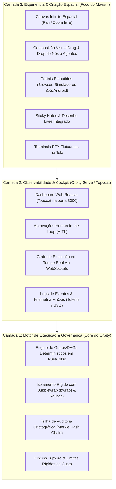

# Análise Arquitetural: Canvas Espacial (Maestri) vs. Orbity Orchestrator

Este documento detalha o funcionamento do paradigma de **Canvas Espacial para Orquestração de Agentes** (popularizado por ferramentas como o [Maestri](https://themaestri.app)), compara seus recursos com a arquitetura atual do **Orbity** e delineia a visão de como essa camada visual se integra à pilha de execução.

---

## 1. Visão Geral das Camadas Arquiteturais

O Canvas do Maestri representa uma **Camada 3 (Experiência & Manipulação Espacial)** adicionada sobre a camada de observabilidade e execução:

---

## 2. Comparativo Detalhado: Maestri Canvas vs. Orbity (`orbity serve`)

| Dimensão | **Maestri** (Canvas) | **Orbity** (`orbity serve` / Topcoat) |
| :--- | :--- | :--- |
| **1. Arquitetura de Nós** | • **Terminais PTY Livres em Tela** interligados por pipes virtuais. • Comunicação ad-hoc ("um agente digita no terminal do outro"). • Fluxo espacial e manual. | • **DAG / Grafo de Execução Determinístico** (Rust/Tokio). • Comunicação estruturada via **Blackboard partilhado & EventBus** pub/sub. • Isolamento seguro com **Sandbox Bubblewrap (`bwrap`)** para cada nó. |
| **2. Interface & Elementos** | • **Infinite Canvas espacial** com Pan/Zoom acelerado por Metal GPU. • Portais (Browser/Emulador iOS incorporados). • Sticky Notes e ferramentas de desenho livre. • Composer flutuante com `@mentions`. | • **Dashboard Web Reativo Topcoat** (porta `3000`). • Visualizador de Grafo em tempo real com status dos nós. • **HITL (Human-in-the-loop)** modal para aprovação de comandos críticos. • Logs de terminal e stream de eventos via WebSockets. |
| **3. Orquestração & Governança** | • **Partituras:** exporta/importa layouts visuais em JSON. • **Floors:** clones de workspace via APFS copy-on-write. • Assistente local (Ombro) para sugerir passos. | • **Contratos Declarativos YAML** (`agents/`, `teams/`, `workflows/`). • **Checkpoints & Replay de Execução** (SQLite WAL). • **FinOps Tracker:** tripwire e limites orçamentários por token/dólar. • Validação criptográfica com **Merkle Hash Chain Audit**. |
| **4. Tecnologia & Plataforma** | • **App Nativo macOS** (Swift, SwiftUI, AppKit). • Aceleração de interface via **GPU Metal**. • Foco em ambiente desktop individual (Mac). | • **Binário Único Compilado em Rust** (Cross-platform Linux/Mac). • Servidor web assíncrono ultra-rápido com **Actix-web + WebSockets**. • Frontend HTML/JS reativo embarcado no binário (sem dependências externas). |

---

## 3. Como Funciona o Paradigma de Canvas Espacial (Maestri)

1. **Terminais como Nós Vivos (*PTY as a Node*):**
   * Cada nó no canvas não é apenas um bloco abstrato, mas um terminal real executando em segundo plano.
   * Suporta qualquer CLI de agente (Claude Code, Agy, Codex, OpenCode ou Shell puro).
2. **Conexões Diretas PTY-to-PTY:**
   * Conectar o Agente A ao Agente B permite que o output de um alimente diretamente o input do outro sem APIs intermediárias.
3. **Portais de Dispositivos e Navegadores:**
   * Janelas incorporadas ao canvas que rodam navegadores web ou simuladores mobile, permitindo que agentes façam inspeção da árvore DOM/elementos nativos.
4. **Notas Integradas e Desenho Livre:**
   * Whiteboard livre integrado com blocos Markdown onde agentes e humanos colaboram no mesmo espaço visual.
5. **Partituras Reutilizáveis:**
   * Exportação do estado do canvas para templates prontos para instanciar times inteiros em novos repositórios.

---

## 4. Oportunidade e Roadmap para o Orbity

O Orbity já implementou os componentes fundamentais de **execução segura e governança corporativa**:
* Isolamento de processo com `bwrap`.
* Rollback de sistema de arquivos.
* Rastreabilidade criptográfica ponta a ponta (Merkle tree audit).
* Controle financeiro de tokens e custos em tempo real (FinOps).

### Próximos Passos (Camada de Canvas no Topcoat):
1. **Modo Canvas no `orbity serve`:** Adicionar uma visão espacial baseada em WebGL/Canvas 2D ou SVG interativo dentro da UI do Topcoat.
2. **Editor Visual de Grafos / YAML:** Permitir ao usuário arrastar agentes da pasta `agents/`, conectá-los graficamente e gerar/sincronizar os YAMLs de time automaticamente.
3. **Terminais Web PTY Conectados:** Integrar terminais Xterm.js nos nós do dashboard para interação direta com os runners em tempo de execução.
